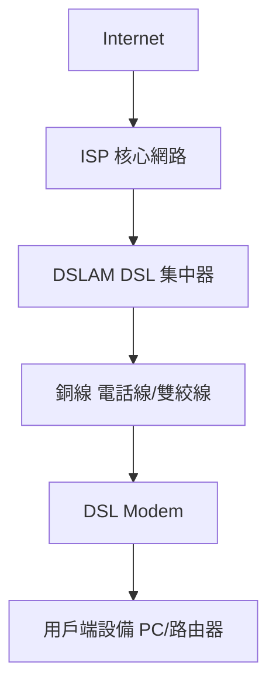

# 計算機網路作業 - 問題與答案

這份文件整理了網路作業中所有的題目、答案與詳細解釋，供學習與參考。

---

## 1. 網路邊緣設備的作用是什麼？

**答案：**  
網路邊緣設備的主要作用是作為內部網路與外部世界之間的「守門員」，負責連接接入網路與網路核心，同時提供安全、路由與流量控制等功能。

**解釋：**  
- **安全防護：** 實施防火牆、入侵檢測與防禦機制，確保只有合法流量能進入內部網路。  
- **路由與轉發：** 將封包正確路由與轉發到目標位置。  
- **流量管理：** 透過 QoS 等技術進行流量控制，確保網路資源有效分配。  
- **連接管理：** 提供內外網路間的連接橋樑，維持整體網路的通暢性。

---

## 2. 請列舉接入網路中導向性介質的三種

**答案：**  
1. 雙絞線  
2. 同軸電纜  
3. 光纖

**解釋：**  
- **雙絞線：** 利用兩根互相纏繞的銅線，有效抵消電磁干擾，常用於電話線和 DSL。  
- **同軸電纜：** 結構上具有中心導體、絕緣層及金屬屏蔽層，常見於有線電視與寬頻網路。  
- **光纖：** 使用玻璃或塑料纖維傳輸光信號，具備高速及高帶寬優勢，適用於現代高速網路。

---

## 3. DSL 與 Cable Modem 提供網路接入所用的技術是什麼？

**答案：**  
DSL 與 Cable Modem 均利用數據調製技術，基本上是基於頻分多工（FDM）原理來實現寬頻上網。

**解釋：**  
- **數據調製：** 將數位數據轉換成適合在模擬傳輸介質上傳送的信號。  
- **頻分多工（FDM）：** 將整個頻帶劃分為多個頻道，同時傳輸語音與數據。例如：  
  - **DSL**：使用離散多音調（DMT）技術分割頻帶。  
  - **Cable Modem**：依據 DOCSIS 標準，利用類似 QAM 的調製技術在不同頻段上傳送數據。

---

## 4. 計算傳輸延遲的公式是什麼？

**答案：**  
傳輸延遲的計算公式為：  
\[ \text{傳輸延遲} = \frac{L}{R} \]

**解釋：**  
- **\(L\)：** 封包大小（位元）。  
- **\(R\)：** 傳輸速率（位元/秒）。  
這表示把整個封包送出所需的時間，就像倒水一樣，取決於水桶容量和流速。

---

## 5. 請畫出 DSL 上網架構圖(Mermaid 語法)

---

## 6. 什麼是「存儲轉發」？

**答案：**  
「存儲轉發」是一種封包交換技術，指網路設備在轉發封包之前，會先完整接收並存儲整個封包，然後進行錯誤檢查，確認數據正確後再轉發到下一個節點。

**解釋：**  
- **完整接收：** 封包到達節點後，設備不會立即轉發，而是先將整個封包接收進來。  
- **錯誤檢查：** 存儲整個封包後，節點會檢查封包是否有錯誤，以確保數據的正確性。  
- **轉發：** 在確認封包無誤後，節點才將其轉發到下一個網路節點。  
- **目的：** 此過程提高了數據傳輸的可靠性，雖然會增加一定延遲，但能防止錯誤資料進入網路。

---

## 7. 請列舉網路擁塞對封包交換的影響

**答案：**  
網路擁塞對封包交換主要會產生以下影響：  
1. 延遲增加  
2. 封包遺失  
3. 抖動現象  
4. 吞吐量降低  
5. 網路不穩定甚至崩潰

**解釋：**  
- **延遲增加：** 當封包在節點排隊等待轉發時，總體傳輸延遲會增加。  
- **封包遺失：** 緩衝區飽和時，新進封包可能被丟棄，導致需要重傳。  
- **抖動現象：** 封包到達時間的不一致會導致延遲抖動，影響即時應用（如視訊或語音通話）。  
- **吞吐量降低：** 擁塞會使有效數據傳輸速率下降。  
- **網路不穩定甚至崩潰：** 長期或嚴重的擁塞可能使網路資源分配失衡，最終導致網路性能急劇下降或崩潰。

---

## 8. 請列舉並說明電路交換與封包交換的優缺點

### 電路交換

**優點：**  
- **專用通路：** 為每個連線提供固定資源和帶寬，延遲低且穩定。  
- **穩定的服務品質：** 由於資源專用，連線品質和延遲容易預測，適合語音等即時應用。

**缺點：**  
- **資源利用效率低：** 連線期間即使部分資源閒置，也無法分配給其他用戶。  
- **連線建立延遲：** 在開始資料傳輸前必須先建立通路，增加初始延遲。  
- **彈性不足：** 對突發性流量的應變能力較差。

### 封包交換

**優點：**  
- **高資源利用率：** 網路資源可由多個用戶共享，根據需求動態分配。  
- **靈活性強：** 能根據網路狀況選擇最佳路由，適應各種資料流。  
- **容錯性好：** 若某一路徑出現故障，封包可改道傳輸，減少中斷。

**缺點：**  
- **延遲和抖動：** 封包可能因排隊等待而產生不穩定的延遲與抖動。  
- **封包丟失：** 在擁塞狀況下，封包可能被丟棄，需要重傳。  
- **額外開銷：** 每個封包需附帶標頭資訊，增加了傳輸負擔。

---

## 9. 請列舉並說明封包延遲的四個來源

**答案：**  
封包延遲主要來自以下四個部分：

1. **處理延遲 (Processing Delay)：**  
   網路節點在解析封包標頭、執行路由決策和錯誤檢查時所需的時間。

2. **排隊延遲 (Queuing Delay)：**  
   封包在節點緩衝區中等待轉發時產生的延遲，取決於當前流量與節點負載。

3. **傳輸延遲 (Transmission Delay)：**  
   將封包所有位元從節點輸出端送入傳輸鏈路所需的時間。  
   計算公式：  
   \[
   \text{傳輸延遲} = \frac{L}{R}
   \]
   其中 \(L\) 為封包大小，\(R\) 為鏈路傳輸速率。

4. **傳播延遲 (Propagation Delay)：**  
   信號從發送端傳遞到接收端所需的時間。  
   計算公式：  
   \[
   \text{傳播延遲} = \frac{d}{s}
   \]
   其中 \(d\) 為鏈路距離，\(s\) 為信號傳播速度。

**解釋：**  
這四個延遲分別描述了封包在從源頭到目的地過程中各個環節所耗費的時間，理解這些概念有助於分析與優化網路傳輸效能。

---

## 10. 請列舉 Internet 五層協定架構

**答案：**  
Internet 五層協定架構如下：

1. **應用層**  
   提供用戶直接使用的網路服務與協定，如 HTTP、FTP、SMTP、DNS 等。

2. **傳輸層**  
   負責端到端的資料傳輸與可靠性控制，主要協定包括 TCP 和 UDP。

3. **網路層**  
   負責封包的路由選擇與轉發，核心協定為 IP，輔以 ICMP、IGMP 等。

4. **數據鏈路層**  
   在相鄰網路節點間傳輸數據，並進行錯誤檢測與校正，常見協定有以太網、PPP。

5. **實體層**  
   定義物理介質與信號傳輸方式，如網線、光纖、無線電波等，負責實際位元傳輸。

---

## 11. 為何以及如何堆疊封包標頭？

**答案：**  
封包標頭堆疊指的是數據從上層（如應用層）向下傳遞到實體層的過程中，每一層都在數據前加上自己的協定標頭，形成多層封裝結構。

**解釋：**  
- **分層封裝：**  
  每一層依據其功能在數據前附加標頭資訊，例如：  
  - 傳輸層加上端口號  
  - 網路層加上 IP 地址  
  - 數據鏈路層加上 MAC 地址  
  這樣各層只需關注自己負責的部分，達到模組化設計。

- **便於解封裝：**  
  在接收端，數據會按照相反的順序進行解封裝，逐層剝除標頭，還原出原始的應用數據。

- **模組化與互操作性：**  
  各層獨立設計，便於更新與維護，同時能夠保證不同系統間的互操作性。

- **錯誤檢查與控制：**  
  每一層的標頭包含必要的控制資訊，有助於檢測和糾正傳輸過程中的錯誤，提高數據傳輸的可靠性。

